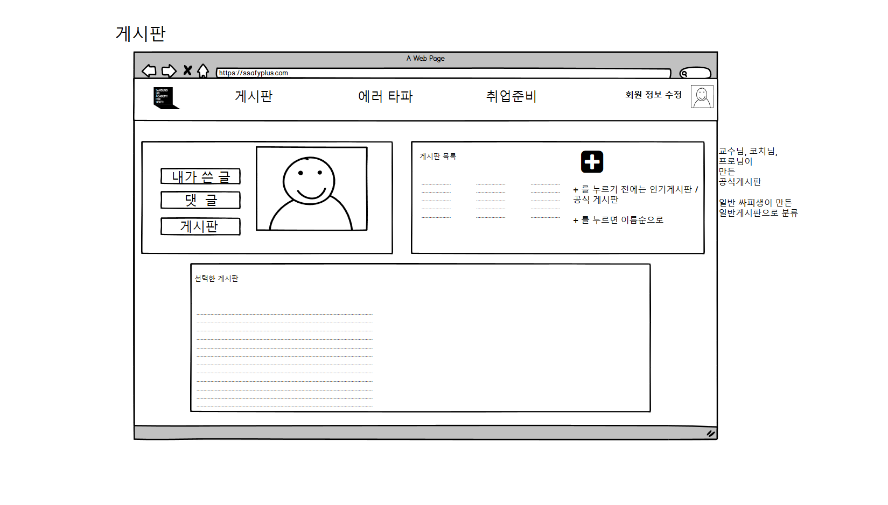
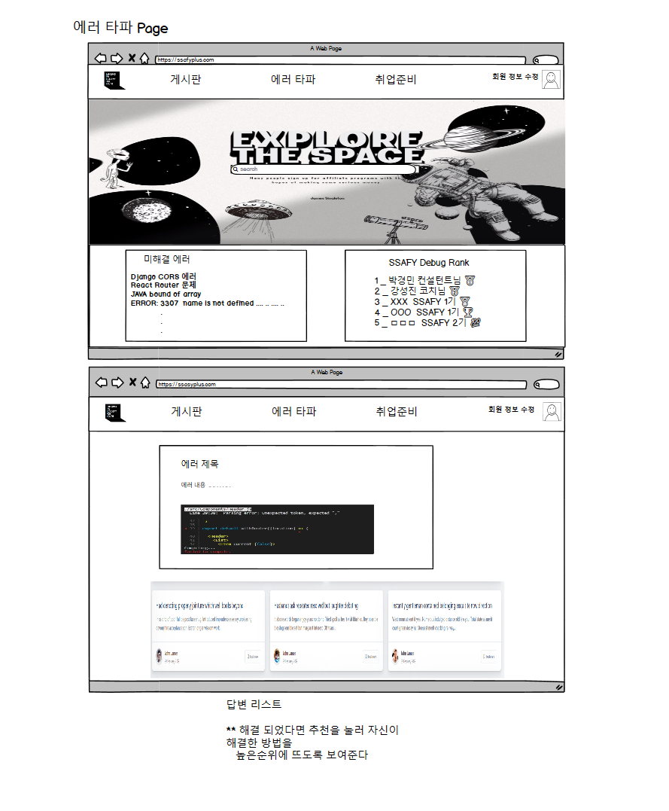
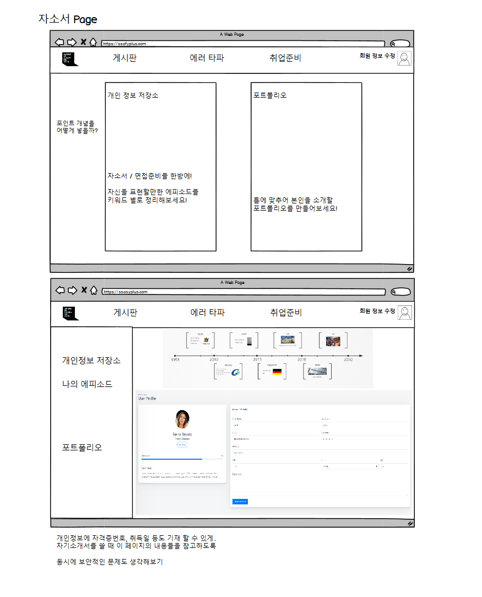
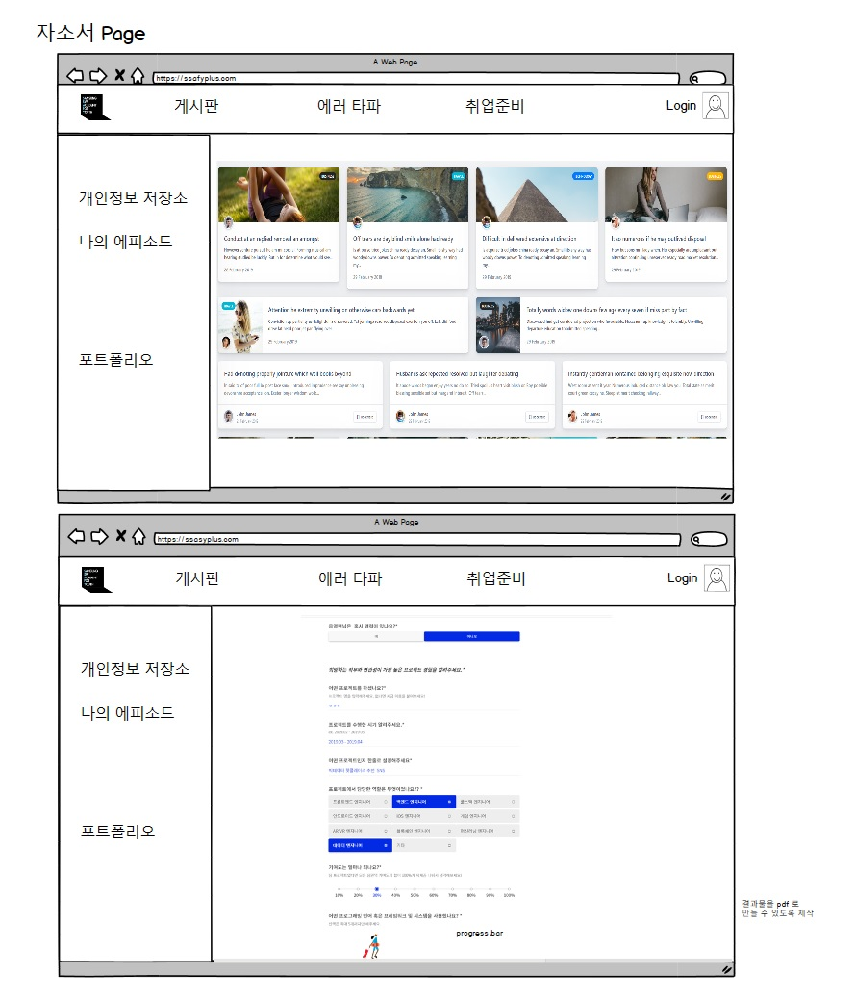

## 4반 1조 심화프로젝트

1차 목업

> MainPage

- 첫 페이지에서 오류 검색을 할 수 있도록 연결
- 하단에는 인기 게시글들이 한눈에 보여 커뮤니티 활동을 할 수 있도록 준비

> board

- 졸업자들도 이용할만한 사이트를 준비 (익명성 자유롭게 부여, 회사들 정보 공유)
- 게시판 만들기를 통해 수 많은 취향을 저격할 수 있는 게시판들을 만들 수 있는 사이트

> Debug

- 오류를 질문 양식에 맞추어 등록하고, 코멘트들을 달아 오류를 해결
- 자신에게 적용된 해결방법은 추천 버튼을 만들어 다른 질문보다 상단에 표시될 수 있도록
- 질문 단위로 box화 하여 보기 좋게

> career / portfolio

- [career] 자소서, 면접준비 페이지  
  자소서를 작성할 때 이 페이지만 보더라도 작성이 완료될 수 있도록
  많은 정보들을 기입할 수 있게 제작
  (관련 보안 사항을 고민해봐야함)

  에피소드별로, 키워드 별로 정리된 게시글들을 볼 수 있어
  면접준비와 자소서 작성에 도움을 줌

- [portfolio] tallent X 페이지를 클론형식으로 + progress bar를 추가하기
  포트폴리오 제작의 최대 걸림돌 \_ 귀찮음
  이를 해결하기 위해 조금씩 질문이 추가되는 형식으로 제작
  progress bar를 통해 중간저장까지 얼마나 남았는지 체크해줌

 

> portfolio

 

---

---

## 제작 배경

1. 싸피 1기 졸업생 500명 2기 500명
   앞으로 싸피인이 될 인원 대략 8000명(3기부터 10기까지 1000명씩)
   싸피 졸업 후 거의 연락이 없이 지냄
   (약 만명의 같은 개발자를 희망하는 대규모 인적 자원 및 동호회)
   블라인드와 같은 단순 자기 회사 기업 정보를 이야기 하는 사이트 성황리 서비스
   --> 기업 정보, 이직 정보등 졸업생들도 활용 가능하게

2. 싸피의 보안 절차 때문에 개인 깃 헙 이나 개인 블로그, 포트폴리오를 활용하지 못함
   졸업 취업자들의 이직용 포트폴리오  
   취업 희망자들의 포트폴리오
   --> 새로운 프로젝트를 시작하기 전이나, 스터디를 구성할때 도움 될 수 있게

3. 물어볼 것이 있지만 컨설턴트님, 코치님, 1학기 강사님의 한계 --> 질문을 할 떄 대부분의 학생이 상세히 상황을 설명하지 못하고, 수많은 스택들을 질문하다 보니 힘드실것으로 예상
   같은 학생들도 뛰어난 학생들이 있음, 참여율을 높이자 --> 질문에 대한 답을 해주는것이 포트폴리오의 하나의 업적으로 남게 진행
   (ex. 백준 온라인 저지의 바킹독 과 같은 사람들, 많이 풀고 질의 응답 많이 하시면서 유명해짐)

4. 수업 시간에 배운것들, 플젝하면서 공부한 것들을 정리 해서 공유(익명 게시판 정보 게시판 초창기에 활발했지만 사용안하는 이유는 포인트에 관심 없어서)
   각 기수 별로 다른 페이지를 운영 하기에 1기와 2기의 정보 공유 글 없어진다.
   --> 강사님, 컨설턴트님, 코치님의 확인을 통해 신뢰성 있는 글이면 업적 부여등, 신뢰성을 높이는게 최우선

## 추가 디테일

1.  포트폴리오
    (Talent X)의 틀을 따라가되 미리보기나 프로젝트에 사진을 추가할 수 있으면 좋겠다.

    프로젝트 별로 저장할 수 있도록 컴포넌트화 시켜 준비
    가능하다면 md 파일로 뽑아낼 수 있도록

    (사진은) 1장추가 / 2장추가 / 4장추가 로 준비

2)  싸피 스택오버플로우

    1. 질문이 너무 겹친다
       같은 과정을 공부하다보니 질문도 비슷비슷한것들이 올라오고, 이 과정이 매년 반복된다.
       mattermost에 Q & A 채널에 올리게 되어 있지만 인강 정답판으로만 활용되고있다

    2. 질문과 답변을 한 공간에서!
       자신의 오류가 해결된 방법이 있으면 버튼을 누를 수 있게 만들고, 해결률이 높은 순으로 상단에 놓는다.
    3. 레벨업 기능을 넣어서 많이 답변하고 싶도록 (아이디를 화려하게 or 아이디 옆에 훈장)

3.  자소설닷컴 - 기업별로 나누지 말고 / 내 자소서를 항목별로 구분하는 사이트
    ex) [성실성] 같은 키워드들을 클릭하면 그에 대한 에피소드들이 나열됨
    https://m.catch.co.kr/

\*\* 참여 유도 방식
디버그 코멘트등 다양한 활동들을 하다보면 포인트를 얻을 수 있고
그 포인트로 합격 자소서, 미해결 질문 상단 표시 등 다양한 이점들을 얻을 수 있도록

---

## 교수님 / 코치님 의견

( + 커뮤니티 기능도 하면 어떨까?)
"""
https://www.teamblind.com/kr/
https://everytime.kr/

블라인드앱
사는모습에 대한 익명의 공개
살살 긁어서 커뮤니티처럼 만들면 어떨까
졸업생들도 회사에서 뭘하고 사는지
익명성으로 자신을 어필할 수 있게

가볍게 쓸 수 있는 사이트는 어떨까?
아이디어를 좀 더 활발하게 이용할 수 있게 고민해보아야 할 것 같다
"""

---

### 기타 사항

#### 프론트엔드 - React

- 신상엽
- 음영현
- 한승민

#### 백엔드 - Spring

- 정하정
- 음영현

커밋 룰

20200508 | 내용 | 음영현

master
ㄴ develop
ㄴ frontend
ㄴ backend
